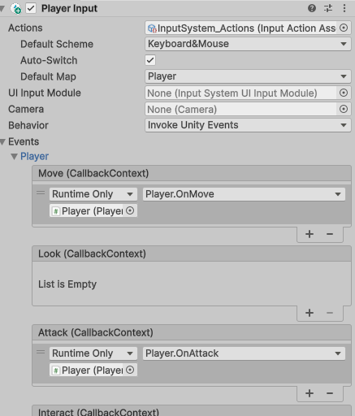

# 2D_PartsChange


파츠교환을 통해 플레이어의 능력치 변화, 공격 스타일 변화등을 줄 수 있다.
파츠를 업그레이드 하여, 더 좋은 스탯으로 업그레이드도 가능하다.

## What's important system?

- 파츠교환 시스템
- json to object (json -> DTO -> Object)
- 맵 생성 알고리즘 //todo
- 델리게이트를 사용한 이벤트 등록형 UI

# Parts Change System

1. 단순하게 스크립터블오브젝트(이하 SO)로 하려고 했으나 지금 당장은 10개의 데이터만 있다고 하더라도 나중에 100개가 추가되면 그때마다 새로운 에셋을 맞춰서 추가해줘야 하는게 너무 시간낭비

2. 따라서 json을 이용해 데이터를 불러온 후, 파싱하여 파싱된 값에 알맞게 컴포넌트를 붙여 파츠의 등급, 데이터 등을 관리하기로 함.
    1. 서버에서 http요청을 통해 json형식으로 값을 가져온다는 가정하에 Json Format으로 데이터를 처리하기로 함
    2. json을 DTO로 파싱한 후, 객체로 데이터를 옮기도록 함.

3. tier(Legendary, Unique, Rare, Common)에 따른 부가적인 요소(파티클, 이펙트) 등은 SO로 관리함.

4. 자세한 데이터는 /Assets/JsonData/~~~.json 에서 확인가능

## DTO로 파싱하는 이유
클라이언트, 서버, 데이터베이스로 크게 분리가 가능한 생태계에서, 클라이언트측의 혹은 서버측의 정보 중, 서로에게 노출되면 안되는 정보들이 존재할 수 있다. 

예를들어, 서버에서는 유저 객체에 DB정보, 토큰 등의 보안과 연결된 문제가 있을수 있는데, 이러한 정보들이 단순한 데이터정보(공격력, 경험치등)과 연관이 없음에도 불구하고, 엮이게 된다.

따라서, 플레이어 단순 DTO에는 공격력, 경험치 등의 단순한 정보만 넣어두고, 데이터베이스에서 정보를 꺼내, DTO로 파싱한 후, 유저에게 주게되면, 불필요한 정보의 노출이나 엮임이 없이 보호, 수정, 획득 할 수 있게된다.

# Interface

각 파츠와 몬스터는 여러가지 인터페이스로 이루어져 있다.

```cs
interface IDamageable
{
    void TakeDamage(int dmg);
    void Dead();
    bool IsDead{get;}
}

interface IAttackable
{
    void Attack(IDamageable damageable, float dmg);
    float Damage{get;}
}

//...todo add later
```


# Json Format

유니티에서 json데이터를 다루기 위해 사용한 라이브러리 이다.

`JsonUtility`, `NewtonJson`.

[Weapon.json](https://github.com/rojae1339/2D_ChangeBody/blob/main/Assets/JsonDatas/Weapon.json)

[Body.json](https://github.com/rojae1339/2D_ChangeBody/blob/main/Assets/JsonDatas/Body.json)

## json parsing
```cs
using System;
using System.Collections.Generic;
using System.IO;
using Newtonsoft.Json;
using UnityEngine;

public class JsonUtil
{
    
    private static Dictionary<string, List<Dictionary<string, object>>> FromJsonToDictionaryList(string json)
    {
        return JsonConvert.DeserializeObject<Dictionary<string, List<Dictionary<string, object>>>>(json);
    }

    public static Dictionary<string, List<Dictionary<string, object>>> LoadPartsWithPath(string partsPath)
    {
        try
        {
            if (!File.Exists(partsPath))
            {
                Debug.LogError($"Weapon.json 파일을 찾을 수 없습니다. 경로: {partsPath}");
                return null;
            }

            string json = File.ReadAllText(partsPath);

            var fromJsonToDictionaryList = FromJsonToDictionaryList(json);
            
            return fromJsonToDictionaryList;
        }
        catch (Exception e)
        {
            Debug.LogError("JSON 파싱 중 예외 발생: " + e);
            return null;
        }
    }
}
```

파일 path를 이용해, 해당 경로에 위치하는 json파일을 읽고, Dictionary형식으로 반환한다.
Dictionary형식은 Dictionary<partsname, List<Dictionary<attribute, value>>> 이다.

## AddressableMAanager
기본적으로 Addressable시스템에 저장되어있는 무기와 몸통의 이름은 다음형식과 같다

`NoWeapon, PascalCase..." 처럼 파스칼케이스로 무기의 이름이 정의되어 있다.


기존 Addressable의 불편한 점이 있다면, InstantiateAsync로 비동기 오브젝트 생성을 하게되면, 원하는 순서대로 오브젝트가 생성이 안될 수 있다는 것이다.

또, LoadAsync나 InstantiateAsync등과 같이, 모두 비동기로 실행되는 메서드로, 지연로딩 문제가 발생될 수 있고, callback을 통해 메서드가 실행되므로, 코드 순서가 복잡해진다는 단점이 존재한다.


따라서, Addressable을 통해 게임시작후, 비동기로 에셋을 로딩한 후에는, 이 데이터들을 캐싱을 해두고, 필요할때는 캐싱된 데이터에서 꺼내어 사용할 수 있도록 했다.

```cs
using System;
using System.Collections;
using System.Collections.Generic;
using UnityEngine;
using UnityEngine.AddressableAssets;
using UnityEngine.ResourceManagement.AsyncOperations;
using UnityEngine.ResourceManagement.ResourceLocations;
using Object = UnityEngine.Object;

public class AddressableManager
{
    //캐시용 dictionary
    private Dictionary<string, UnityEngine.Object> _resources = new Dictionary<string, Object>();
    private Dictionary<string, HashSet<string>> _labelToKeys = new Dictionary<string, HashSet<string>>();

    public T Load<T>(string key) where T : Object
    {
        if (_resources.TryGetValue(key, out Object obj)) return obj as T;

        return null;
    }

    public GameObject Instantiate(string key, Transform parent = null)
    {
        GameObject gameObject = Load<GameObject>(key);
        if (gameObject == null)
        {
            Debug.Log($"어드레서블을 불러오지 못했습니다. Key: {key}");
            return null;
        }

        GameObject instantiate = Object.Instantiate(gameObject, parent);
        instantiate.name = gameObject.name;
        return instantiate;
    }

    public void Destroy(GameObject go)
    {
        if (go == null) return;
        
        Object.Destroy(go);
    }
    
    //라벨에 따른 모든 키(이름) 구하기
    public HashSet<string> GetKeysByLabel(string label)
    {
        return _labelToKeys.TryGetValue(label, out var list) ? list : new HashSet<string>();
    }

    
    //그룹에 따른 모든 키 구하기
    public List<string> GetKeysByGroup(string[] group)
    {
        var keys = new List<string>();
        foreach (string label in group)
        {
            keys.AddRange(GetKeysByLabel(label)); // 중첩 루프 제거
        }
        return keys;
    }
    


    #region 어드레서블

    //미리 로딩해서 dictionary에 캐싱하기
    
    //키 값으로 로딩
    public void LoadAsync<T>(string key, Action<T> callback = null) where T : Object
    {
        if (_resources.TryGetValue(key, out Object resource))
        {
            callback?.Invoke(resource as T);
            return;
        }

        AsyncOperationHandle<T> asyncOperation = Addressables.LoadAssetAsync<T>(key);
        asyncOperation.Completed += oper =>
        {
            _resources.Add(key, oper.Result);
            callback?.Invoke(oper.Result);
        };
    }
    
    //label에 해당되는 모든 게임오브젝트 로딩(LoadAsync 래핑 메서드)
    public void LoadAllAsync<T>(string label, Action<string, int, int> loadCallback) where T : Object
    {
        AsyncOperationHandle<IList<IResourceLocation>> asyncOperation = Addressables.LoadResourceLocationsAsync(label, typeof(T));

        asyncOperation.Completed += op =>
        {
            int loadCount = 0;
            int totalCount = op.Result.Count;

            foreach (IResourceLocation resourceLocation in op.Result)
            {
                LoadAsync<T>(resourceLocation.PrimaryKey, obj =>
                {
                    //캐싱된 키 추가
                    if (!_labelToKeys.ContainsKey(label))
                    {
                        _labelToKeys[label] = new HashSet<string>();
                    }
                    
                    _labelToKeys[label].Add(resourceLocation.PrimaryKey);
                    
                    loadCount++;
                    loadCallback?.Invoke(resourceLocation.PrimaryKey, loadCount, totalCount);
                });
            }
        };
    }
    
    //그룹의 모든 라벨을 순회하며 로드 하기(LoadAllAsync래핑 메서드)
    public void LoadAllByLabels<T>(string[] labels, Action onComplete) where T : Object
    {
        int totalLabelCount = labels.Length;
        int finishedLabelCount = 0;

        foreach (string label in labels)
        {
            LoadAllAsync<T>(label, (key, count, totalCount) =>
            {
                // 한 라벨 로딩이 끝났을 때만 증가
                if (count == totalCount)
                {
                    finishedLabelCount++;

                    if (finishedLabelCount == totalLabelCount)
                    {
                        // 모든 라벨의 리소스 로딩 완료
                        onComplete?.Invoke();
                    }
                }
            });
        }
    }


    #endregion
}

```

`Managers`스크립트의 Init부분을 보면, 게임 시작후, Managers오브젝트가 메모리에 올라가고, AddressableManager의 LoadAllByLabels를 통해, 그룹의 라벨별로 데이터를 비동기 로드 한 후,

로드가 끝나면 MapManager의 ChangeStage를 통해 IStageSpawner의 CreateParts를 통해, 각 스테이지에 맞는 파츠들을 생성하도록 했다.


하지만 비동기 처리시, 모든 비동기 호출이 끝날때 무언가가 되어야하는 상황이 있다면, //todo

### Coroutine
//todo

## PartsDataManager (json to DTO, DTO to Object)
PartsDataManager에서 모든 데이터를 관리하게 된다.

```cs
using System;
using System.Collections.Generic;

namespace Managers
{
    public class PartsDataManager
    {
        private const string _weaponJsonPath = "Assets/JsonDatas/Weapon.json";
        private const string _bodyJsonPath = "Assets/JsonDatas/Body.json";

        private Dictionary<string, List<Dictionary<string, object>>> _weaponData = new();
        private Dictionary<string, List<Dictionary<string, object>>> _bodyData = new();
        
        public Dictionary<string, List<Dictionary<string, object>>> WeaponData { get => _weaponData; }
        public Dictionary<string, List<Dictionary<string, object>>> BodyData { get => _bodyData; }

        public void Init()
        {
            _weaponData = JsonUtil.LoadPartsWithPath(_weaponJsonPath);
            _bodyData = JsonUtil.LoadPartsWithPath(_bodyJsonPath);
        }

        #region 파츠 이름으로 데이터 리스트 가져오기
        
        //무기 이름으로 무기리스트 반환
        private List<Dictionary<string, object>> GetWeaponInfoListByWeaponName(string name)
        {
            if (_weaponData.TryGetValue(name, out var list))
            {
                return list;
            }

            return new List<Dictionary<string, object>>();
        }
        
        //몸통 이름으로 몸통리스트 반환
        private List<Dictionary<string, object>> GetBodyInfoListByBodyName(string name)
        {
            if (_bodyData.TryGetValue(name, out var list))
            {
                return list;
            }

            return new List<Dictionary<string, object>>();
        }

        #endregion

        #region 파츠 이름으로 DTO 리스트 가져오기

        public List<WeaponDTO> GetWeaponDTOListByName(string name)
        {
            var dictList = GetWeaponInfoListByWeaponName(name);
            var result = new List<WeaponDTO>();
            foreach (var dict in dictList)
            {
                result.Add(new WeaponDTO() {
                    WeaponName = name,
                    Tier = (TierType)Enum.Parse(typeof(TierType), dict[WeaponKeys.Tier].ToString()),
                    AttackDamage = Convert.ToDouble(dict[WeaponKeys.AttackDamage]),
                    AttackSpeed = Convert.ToDouble(dict[WeaponKeys.AttackSpeed]),
                    BulletSpeed = dict.TryGetValue(WeaponKeys.BulletSpeed, out var value) ? Convert.ToDouble(value) : (double?)null,
                    HandType = (WeaponHandType)Enum.Parse(typeof(WeaponHandType), dict[WeaponKeys.WeaponHandType].ToString()),
                    WeaponAttackType = (AttackType)Enum.Parse(typeof(AttackType), dict[WeaponKeys.AttackType].ToString()),
                    MaxBulletCount = dict.TryGetValue(WeaponKeys.MaxBulletCount, out var value1) ? Convert.ToInt32(value1) : (int?)null,
                    ReloadSpeed = dict.TryGetValue(WeaponKeys.ReloadSpeed, out var value2) ? Convert.ToDouble(value2) : (double?)null,
                    PartDropProbability = Convert.ToDouble(dict[WeaponKeys.PartDropProbability]),
                    UpgradeFleshCount = Convert.ToInt32(dict[WeaponKeys.UpgradeFleshCount])
                });
            }
            return result;
        }


        public List<BodyDTO> GetBodyDTOListByName(string name)
        {
            var dictList = GetBodyInfoListByBodyName(name);
            var result = new List<BodyDTO>();
            foreach (var dict in dictList)
            {
                result.Add(new BodyDTO {
                    BodyName = name,
                    Tier = (TierType)Enum.Parse(typeof(TierType), dict[BodyKeys.Tier].ToString()),
                    Hp = Convert.ToInt32(dict[BodyKeys.Hp]),
                    Shield = Convert.ToInt32(dict[BodyKeys.Shield]),
                    IsDead = Convert.ToBoolean(dict[BodyKeys.IsDead]),
                    IsDmgHalf = Convert.ToBoolean(dict[BodyKeys.IsDmgHalf]),
                    UpgradeFleshCount = Convert.ToInt32(dict[BodyKeys.UpgradeFleshCount]),
                    PartDropProbability = Convert.ToSingle(dict[BodyKeys.PartDropProbability])
                });
            }
            return result;
        }

        #endregion

    }
}
```

게임이 시작되고, `Managers`스크립트의 `Init()`이 호출되면, `PartsDataManager`의 `Init()`도 함께 호출되게 된다.
[Managers/Init()](https://github.com/rojae1339/2D_ChangeBody/blob/main/Assets/Scripts/Managers/Managers.cs#L53)

1. jsonUtil을 이용해, 해당 경로에 있는 json을 파싱하여, 위의 선언된 타입형식으로 `_weaponData`, `_bodyData`에 데이터들이 저장되게 된다.
    - `"noWeapon" : {"tier": "Legendary", "attackDamage": ...., ..., ...}` 형식
2. 이후 `AddressableManager`를 통해 등록된 파츠들의 로딩이 완료되면, `MapManager`의 `ChangeStage()`를 통해, Main스테이지로 스테이지가 변경되게 되며, `MainStageSpawner`를 통해 파츠들이 Instantiate되게 된다.
3. Spawner에서는 `PartsDataManager`의 각 ~~~Data들의 key값들을 가져와, 해당 키 값들로, `PartsDataManager`의 `GetWeaponDTOListByName()`, `GetBodyDTOListByName()`을 호출하여, json이 DTO로 파싱된 후, 해당 DTO리스트가 반환되게 되고, 반복문을 통해 리스트를 순회하며 dto의 값들을 일반 객체로 매핑하게 된다.

## MapManager
//todo

## Player

플레이어는, 유니티6에서 제공되는 NIS(New Input System)을 통해, 키를 이벤트로 입력받아서, 해당키에 맞는 콜백을 호출하도록 했다.

`PlayerController`에서는 NIS와 동기화되어 키 인풋만 담당하도록 하였다.

`PlayerMove`에서는 Player에서 MoveDir를 입력받아, 플레이어가 해당 방향으로 움직이도록 구현하였다.

`PlayerAnimation`에서는 Player에서 현재 플레이어의 행동상태에 따라 애니메이터의 parameter를 호출하여, 애니메이션이 변화되도록 하였다.

`Player`는 총괄 스크립트로, 플레이어의 행동에 관련된 것들을 담당한다.
//todo


# Player Management

- Player data(for example, gold, fleshCount) -> PlayerManager

- Player State(for example, move, animation etc)
    - PlayerController -> key input processing
    - PlayerMove -> move player role
    - PlayerAnimation -> change player animations with CurrentAnimationState
    - Player -> All player related components' container role (for example, throw animationState to PlayerAnimation, throw move to PlayerMove, container of InputKeySystem's event.)
        - 